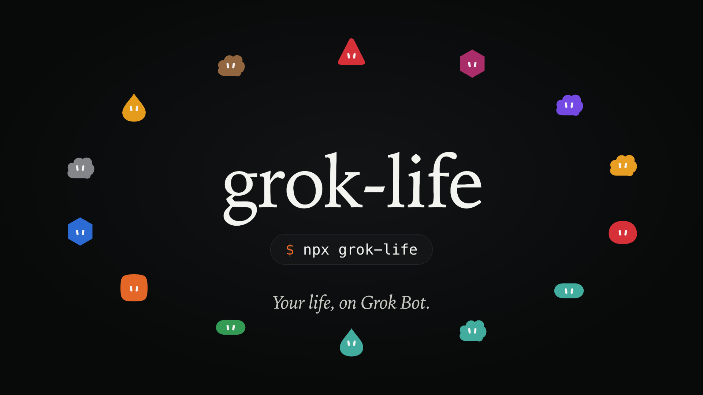

# grok-life

**Set up Grok Bot like a real, working life setup.**

[](https://www.npmjs.com/package/grok-life)
[](https://github.com/anup-a/grok-life/actions/workflows/ci.yml)
[](LICENSE)

[](docs/demo.mp4)

grok-life copies a real Grok Bot setup (14 Bots that run every day for one person) and makes it yours. Your Chief of Staff asks a few questions, creates the Bots you pick, briefs each one, and then manages them for you.

```sh
npx grok-life
```

It copies a setup message and opens Grok Bot. Open your **Chief of Staff** (or click **+**, then **Create new Bot**), paste, and send.

## What you get

| Bot | What it does | Routines |
| --- | --- | --- |
| **Inbox** | Personal Gmail: only what needs a reply or a decision, drafts in your voice | Weekday triage, 08:30 |
| **2nd Inbox** | A second Gmail (school or work), kept apart from your personal inbox | Weekday triage, 08:00 |
| **Calendar** | Today and tomorrow, conflicts, prep, protected mornings | Weekday briefing, 07:02 |
| **Health** | Lab reports, prescriptions, follow-ups and daily habits, kept private | Habit check-in, wearable read (optional) |
| **Bills** | Card and utility due dates; speaks up only when something is due or changed | Weekday check, monthly EMI heads-up |
| **Credit Card Max** | Which card to use for a purchase, and perks you are leaving unused | Monthly rollup |
| **Search** | Sourced web research for you and your other Bots | |
| **Restaurants** | A few strong picks near you, cross-checked across review sites | |
| **LinkedIn** | DMs, InMail and requests that need you, drafted in your voice | |
| **GitHub** | PRs, issues, releases and code search on your account | |
| **Investing** | A dry-run trading desk: scans and reminders, never places trades | Pre-open, close, after-close (optional) |
| **Growth** | Growth strategist and PM for the products you are building | Friday check-in, daily metrics, post drafts |
| **App Builder** | Apple developer setup, App Store Connect, signing and shipping | |
| **Bridge** | Lets your Bots run Claude Code or Codex on your computer ([grok-bot-bridge](https://github.com/anup-a/grok-bot-bridge)) | |

Inbox, Calendar, Health, Bills and Search are picked by default. `npx grok-life list` shows them all.

## How it works

The same way the original setup was built: Chief of Staff creates each Bot (`CreateAgent`), sends it a briefing (`SendToAgent`), and each Bot sets its own avatar, routines and memory. Bots hand work to each other: Inbox passes statements to Bills and medical mail to Health.

- **Connect once.** Connectors (Gmail, Google Calendar, Exa, GitHub) are shared by every Bot in your account. Chief of Staff tells you which ones your Bots need.
- **Routines start paused.** You're asked once whether to turn them on.
- **Quiet by default.** Bots message you only when something needs you.
- **Nothing goes out without you.** Every Bot is told never to send, post, pay, book or delete without your confirmation.

## Commands

| Command | What it does |
| --- | --- |
| `npx grok-life` | Copy the setup message and open Grok Bot |
| `npx grok-life list` | The Bots it can set up |
| `npx grok-life message` | Print the setup message |
| `npx grok-life playbook` | Print the playbook Chief of Staff follows |
| `npx grok-life bridge` | Connect Claude Code or Codex on this computer |

Pre-fill answers with `--name`, `--tz`, `--email` and `--city`.

## Customize

Everything lives in [`catalog/bots.json`](catalog/bots.json): each Bot's description, avatar, routines (cron plus prompt), connectors, built-in skills and hand-offs. Edit it and run `npm test`.

## License

MIT
